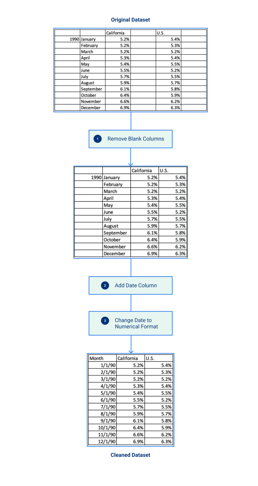
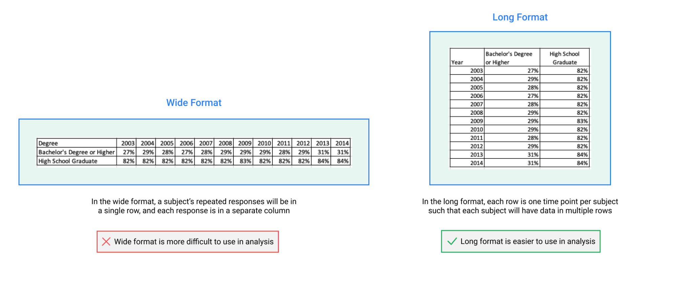

# 2. Prepare Data for Publishing

## Consolidate and merge raw data 

Consolidating data refers to the gathering of existing datasets from multiple sources. It is important to ensure that each variable is processed and documented in the same way across these datasets. This makes it easier for users to understand the consolidated data and for the data producers to create a consistent dataset.** **

We are not prescriptive about how you merge data as that varies by tool. Please consult documentation or peers for specific technical questions for merging data. Regardless of approach, adopt one that is repeatable by you and others.


**Decision point: **

Do you have multiple sources (spreadsheets, database tables, etc.) that you need to consolidate into a single dataset? 

**If yes**, this section gives a generalizable, non-exhaustive checklist to consider when merging data. You may need to consult with other staff in your department on specific technical implementations of a repeatable process. 

**If no**, go ahead and skip to 3. Simplify and clean data. 


### General Checklist: 

* [ ] Conduct a preliminary assessment of your datasets to prepare for merging 
  * [ ] Identify how many rows you have across sources 
  * [ ] Analyze the fields for each source and map on to your target data output 
  * [ ] Determine whether data includes personally identifiable information (PII) or personal health information (PHI)
* [ ] Quality check your merged data output 
  * [ ] Check whether the number of rows in merged dataset match the number of rows across sources 
  * [ ] Ensure that numerical fields in merged datasets match with source datasets
  * [ ] Identify fields where there are rows with no values to check if data was dropped as a result of your merge logic 
  * [ ] Check if dataset is inclusive of the full population represented across datasets
  * [ ] Ensure that categories are consistent across sources


****:file_folder: **Additional Resources: **

Refer to [Consolidate and Merge Raw Data: Detailed Checklist](reference-and-additional-documents/consolidate-and-merge-raw-data-detailed-checklist.md) for more detailed guidance on the steps above.


## Simplify and clean data  

This step may be more or less complicated depending on the source data.

In some cases, you may only receive a dataset and not have much control over how it’s put together. We recommend working closely with anyone that is involved in the preparation of data for publishing and sharing this section to make sure the data is the best it can be before publishing.

The considerations in here are generalizable across datasets, but are a minimum. Please use your best judgment to apply additional interventions that are specific to the data you’re publishing.


**Note: **Simplifying and cleaning data rarely happens in a linear fashion. If you have to merge datasets, you may find yourself doing the following work along with the previous section.


### **General checklist:**

* [ ] De-identify data if necessary
* [ ] Determine data format and quality check the dataset
* [ ] Check dataset for appropriate formatting for use on the open data portal
* [ ] Saving your dataset for publishing on the open data portal


****:file_folder: **Additional Resources: **

Refer to [Simplify and Clean Data: Detailed Checklist](reference-and-additional-documents/simplify-and-clean-data.md) for more detailed guidance on the steps above.


### :page_with_curl: Reformatting examples: 

Examples in the tabs below, blah blah

**Example 1. ** Demonstrates cleaning up a dataset from improper date format to machine-readable date format by first removing blank cells in columns, then creating a date column, then replacing the old format with the new, single column with a header of 'date' at the top of the column.

**Example 2.** compares a long formatted dataset to a wide formatted dataset. A long formatted dataset is machine-readable, a wide-formatted dataset is less so.











****
