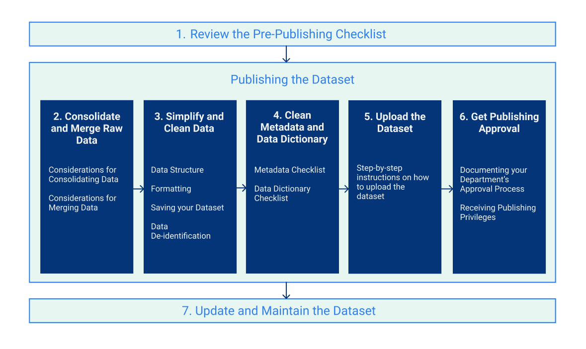

# Introduction

## Who this is for

This handbook is for California State employees that want to publish open data on the [State’s Open Data Portal](https://data.ca.gov).


The guidance on uploading and publishing data only applies to direct publishing on [https://data.ca.gov](https://data.ca.gov). However, the rest of the guidance establishes **minimum** expectations for all California open data publishing.


### Organizations that publish on separate portals

If you are in one of the following State organizations, you should start with publishing open data directly through your agency’s open data portal:

* [Board of Equalization](https://www.boe.ca.gov/dataportal/)
* [Controller’s Office](https://bythenumbers.sco.ca.gov/browse)
* [Department of Justice](https://openjustice.doj.ca.gov/data)
* [Department of Tax and Fee Administration](https://www.cdtfa.ca.gov/DataPortal/index.htm)
* [Employment Development Department](https://data.edd.ca.gov)
* [Franchise Tax Board](https://data.ftb.ca.gov)
* [Health and Human Services Agency](https://data.chhs.ca.gov)
* [Natural Resources Agency](https://data.cnra.ca.gov)
* [Treasurer’s Office](https://debtwatch.treasurer.ca.gov)

Please reach out to your data coordinator for any specific guidance if you are in any of the above organizations, but the guidance below is generalizable across the State and sets the minimum expectations for publishing open data.

When publishing to your organization’s portal, in many cases[\[2\]](broken-reference/), those datasets will be automatically included and discoverable from the statewide open data portal through a process called harvesting (don’t worry, you don’t need to worry about how harvesting works to publish open data).

## How this is organized

Publishing a new open dataset takes some planning and coordination, but it doesn’t have to be difficult. This handbook is designed to provide a reference guide you can return to and take piece by piece as you move through the process.

The handbook is divided into sections that correspond to a general publishing process. The diagram below shows those steps and links to guidance for each step. The pre-publishing checklist pulls up the most important considerations when getting started to minimize surprises during your journey.

If you have questions, you can ask them in the [CalData Communities Open Data Community.](https://teams.microsoft.com/l/channel/19%3a037b34f454d94a9fa7f6aa964c052af4%40thread.tacv2/Open%20Data?groupId=0f45987a-e632-4e93-be66-ebfd6079e926\&tenantId=68a88534-151d-4e79-8046-09be7890656c)

## Publisher’s journey steps

The steps in the diagram are reproduced below with brief definitions.

1. [**Review the pre-publishing checklist.**](review-the-pre-publishing-checklist.md) Summarizes things to be aware of early in the process to minimize surprises later on.
2. [**Consolidate and merge raw data.**](broken-reference) If you are producing a dataset that requires consolidation of multiple sources (e.g. data from multiple counties), some guidelines on approaching that to minimize errors.
3. [**Simplify and clean data.**](reference-and-additional-documents/simplify-and-clean-data.md) Guidance on what makes a clean dataset and tips on how to get to clean data. Does not include exhaustive consideration of all data quality issues.
4. [**Create metadata and data dictionary.**](create-metadata-and-data-dictionary.md) Guidance on what minimum metadata and documentation is needed to make the dataset useful to others.
5. [**Upload the dataset.**](upload-the-dataset.md) Guidance on uploading the dataset to the open data portal.
6. [**Get publishing approval.**](get-publishing-approval.md) Guidance on getting final approval to make the dataset publicly available.
7. [**Update and maintain the dataset.**](update-and-maintain-the-dataset.md) Guidance on considerations for update and maintenance of the dataset.
