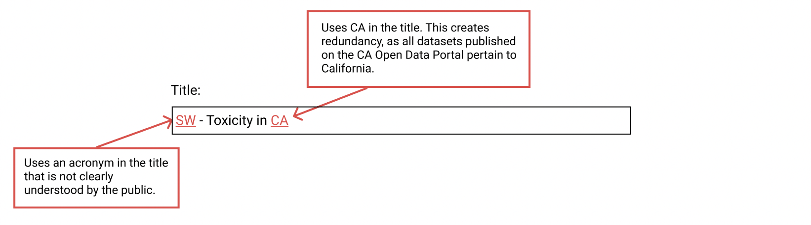
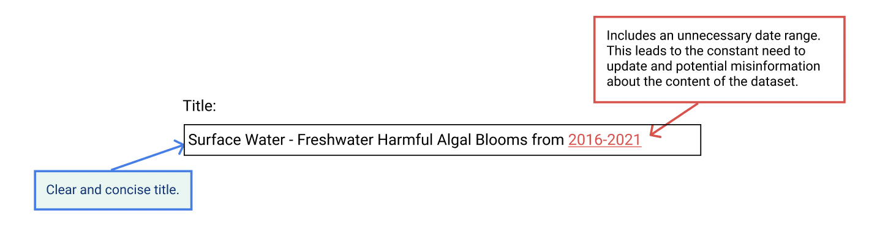
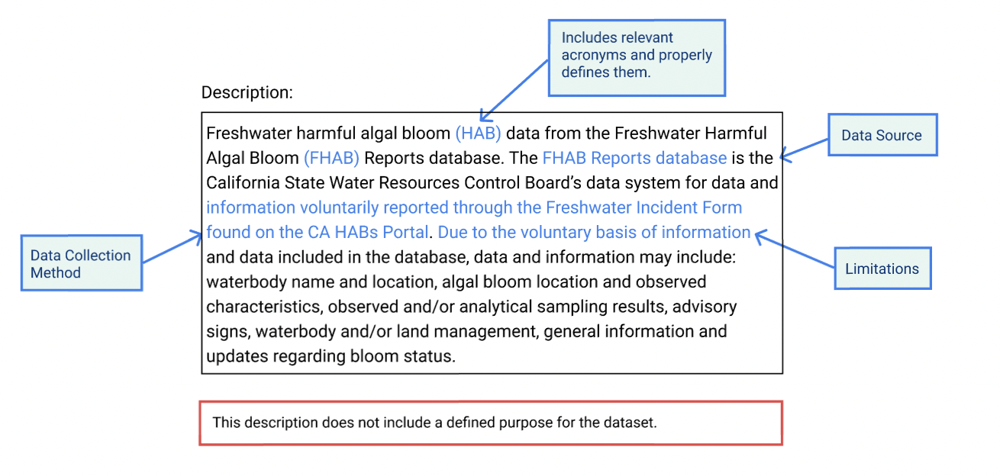
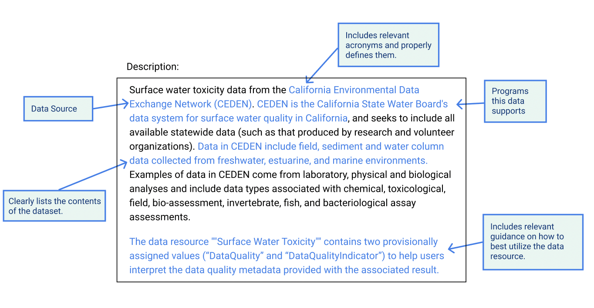
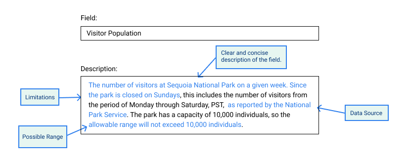
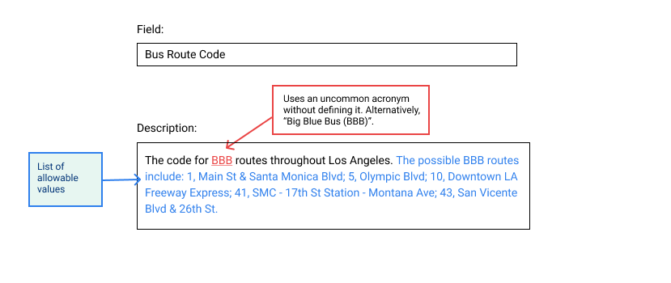

# 3. Create Metadata and Data Dictionary

Metadata is information about a dataset that makes the data easy to find or identify. Metadata describes the dataset’s structure, data elements, its creation, access, format, and content.

Metadata is necessary to improve the discoverability of data within the open data portal and on external search engines. The more relevant information the search engine has about your data resources, the easier it will be for it to point to your resource when users search. Metadata is what helps a user narrow down thousands of data resources to just a few that will likely provide the data they need to answer their question. 

**Without good metadata, datasets are prone to getting lost.** Below we define minimum standards and best practices for:

1. [Creating good metadata](create-metadata-and-data-dictionary.md#create-your-metadata)
2. [Creating a good data dictionary](create-metadata-and-data-dictionary.md#create-your-data-dictionary)

## Create your metadata


****:open_file_folder: **Additional Resources:** [Download the metadata template](https://docs.google.com/spreadsheets/u/0/d/1CHJuE89yiNUHsxrjQxseMmxRWDAs11M4/edit) to fill in the required information. 


### **General checklist: **

* [ ] Fill in the metadata fields relevant to your dataset - [see metadata field definition reference](reference-and-additional-documents/metadata-field-definitions.md)
* [ ] Make sure your dataset title is accessible and descriptive  
* [ ] Ensure your dataset description is user friendly


****:open_file_folder: **Additional** **Resources:** Refer to [Metadata Field Definitions ](reference-and-additional-documents/metadata-field-definitions.md)for definitions of and further guidance on metadata fields. 


### ****:page_with_curl: **Best practices: Dataset title content**

| **Do's**                                                | **Dont's**                                                                                                                                                                                                                                                                                          |
| ------------------------------------------------------- | --------------------------------------------------------------------------------------------------------------------------------------------------------------------------------------------------------------------------------------------------------------------------------------------------- |
| :white_check_mark: Keep titles concise and informative. | 
❌ Avoid using CA, California in the title if it does not meaningfully clarify the scope.

❌ Avoid using jargon and spell out acronyms.
 |

****

**Illustrative examples **











****

### ****:page_with_curl:** Best practices: Dataset description content**

| **Do's**                                                                                                                                                                                                                                                                                                                                                                                                                                                                                                                                                                                                                                                                                                                                                                                                                                                                                                                                                                                                    | **Dont's**                                            |
| ----------------------------------------------------------------------------------------------------------------------------------------------------------------------------------------------------------------------------------------------------------------------------------------------------------------------------------------------------------------------------------------------------------------------------------------------------------------------------------------------------------------------------------------------------------------------------------------------------------------------------------------------------------------------------------------------------------------------------------------------------------------------------------------------------------------------------------------------------------------------------------------------------------------------------------------------------------------------------------------------------------- | ----------------------------------------------------- |
| 
✅ Create a summary paragraph that details the contents of your data table. The first few sentences are the most important.

✅ Address the following points, if applicable:
<ul><li>Data collection method and source (not the name of the database, but from what process, people, or organizations does the data come)</li><li>
Purpose of dataset
<ul><li>Include relevant ordinance references, particularly if the method or elements collected are defined in law</li></ul></li><li>Programs or policies this data supports</li></ul>
✅ Include related legislation info if applicable.

✅ Include relevant acronyms, but make sure to clearly define them at least once.
 | :x: Avoid using acronyms in your first few sentences. |

****

**Illustrative examples**











****

## Create your data dictionary

A data dictionary is the information you provide that tells a user exactly what is in your data resource and how it can be used. A data dictionary is what helps the user decide if your data resource will provide the data that is needed to answer their question, and also if it is in a form they can use.

**General checklist: **

* [ ] For each field, document the name, title, data type, definition and valid values if applicable 
* [ ] Write field definitions in user friendly language


****:open_file_folder: **Additional Resources: **Refer to [Data Dictionary: What to Include](reference-and-additional-documents/data-dictionary-what-to-include.md) for further guidance on what to include in the data dictionary. 


### :page_with_curl:** **Best practices: Field definitions

| **Dos**                                                                                                                                                                                                                                                                                                                                                                                                                                                                                                                                                                                                                                                                                                                                                                                                                                                                                                                                                                                                                                                                                                                                                                                               | **Donts**                                                                                                          |
| ----------------------------------------------------------------------------------------------------------------------------------------------------------------------------------------------------------------------------------------------------------------------------------------------------------------------------------------------------------------------------------------------------------------------------------------------------------------------------------------------------------------------------------------------------------------------------------------------------------------------------------------------------------------------------------------------------------------------------------------------------------------------------------------------------------------------------------------------------------------------------------------------------------------------------------------------------------------------------------------------------------------------------------------------------------------------------------------------------------------------------------------------------------------------------------------------------- | ------------------------------------------------------------------------------------------------------------------ |
| 
✅ Be precise, unambiguous, and concise.

✅ Include relevant acronyms, but make sure to clearly define them at least once.

✅ If the value is a date, document the time zone of the recording, e.g. PST (Pacific Daylight Time).

✅ If the values are calculated, the source of raw data and calculation method should be included.

✅ Include units of measurement if applicable.

✅ Include any known limitations of the data collected, e.g. groundwater levels were not measured in the month of January.

✅ If the field is a category, include the list of allowable values, e.g. allowable or expected range.
 | :x: Avoid writing these definitions from the perspective of an expert; write with the average public user in mind. |

#### Illustrative examples for field name, field title and data type

| _**Field Name**_    | _**Field Title**_           | _**Data Type**_ |
| ------------------- | --------------------------- | --------------- |
| CalculatedValue     | Calculation Value           | float           |
| Dilution            | Dilution                    | float           |
| PSI                 | Pound-Force per Square Inch | float           |
| Latitude            | Latitude                    | float           |
| **WaterBodyType**   | Type of Waterbody           | text            |
| BloomLastVerifiedOn | Bloom Last Verified on      | date            |

####

#### Illustrative examples for field definitions












****:open_file_folder: **Additional Resources: **

* [Metadata template](https://docs.google.com/spreadsheets/u/0/d/1CHJuE89yiNUHsxrjQxseMmxRWDAs11M4/edit)

