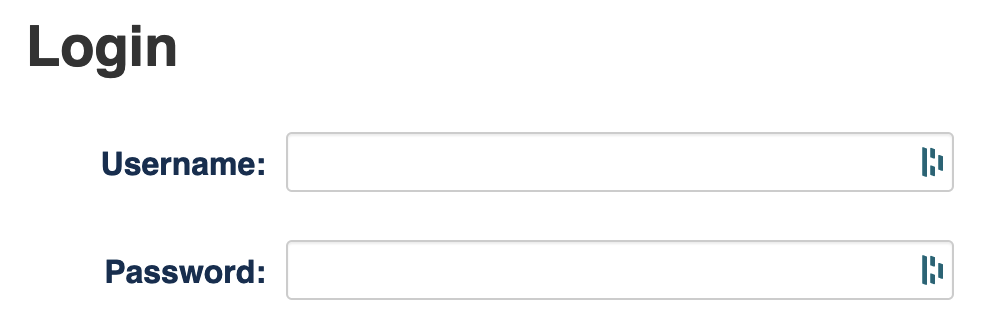
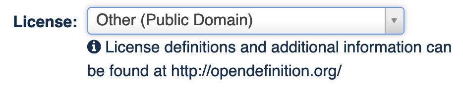
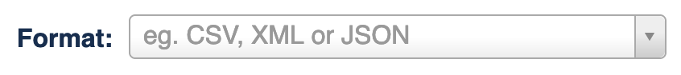
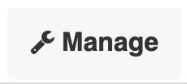
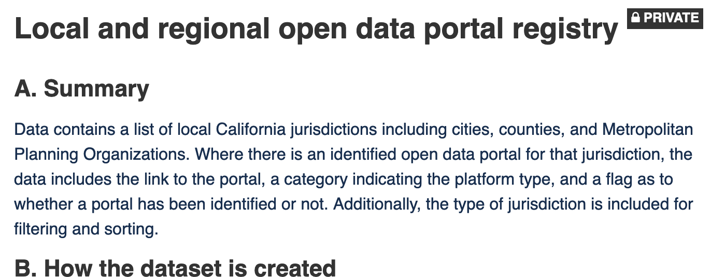

# Detailed Steps for Uploading Data to the Portal

**Referenced from:**


[4.-upload-the-dataset.md](../4.-upload-the-dataset.md)


Below are the detailed steps broken up into the following sections:

1. [Create dataset on the open data portal & add initial metadata](detailed-steps-for-uploading-data-to-the-portal.md#create-dataset-and-add-initial-metadata)
2. [Upload data resources](detailed-steps-for-uploading-data-to-the-portal.md#upload-data-resources)
3. [If applicable, upload non-data related resources (guides, documentation, etc)](detailed-steps-for-uploading-data-to-the-portal.md#if-applicable-upload-non-data-related-resources-guides-documentation-etc)
4. [Add field definitions to your data](detailed-steps-for-uploading-data-to-the-portal.md#add-field-definitions-to-your-data)
5. [Review your dataset metadata](detailed-steps-for-uploading-data-to-the-portal.md#review-your-dataset-metadata)
6. [Review your resources](detailed-steps-for-uploading-data-to-the-portal.md#review-your-resources)
7. [Share the private dataset with your team for review and approval](detailed-steps-for-uploading-data-to-the-portal.md#share-the-private-dataset-with-your-team-for-review-and-approval)
8. [Make public after approval](detailed-steps-for-uploading-data-to-the-portal.md#make-public-after-approval)


**Experience errors during the upload process?**

Reach out to the [open data team at the Department of Technology](mailto:opendata@state.ca.gov?subject=Troubleshooting%20issues%20during%20dataset%20upload).


## 1. Create dataset on the open data portal & add initial metadata

| Step                                                                                                                                                                                                                                                            | Screenshot                                   |
| --------------------------------------------------------------------------------------------------------------------------------------------------------------------------------------------------------------------------------------------------------------- | -------------------------------------------- |
| [Login to the open data portal](https://data.ca.gov/user/login)                                                                                                                                                                                                 |             |
| Click on the **My Datasets** tab                                                                                                                                                                                                                                |      |
| Click the button labeled **Add Dataset**                                                                                                                                                                                                                        |      |
| Enter metadata by copying from the Metadata Template to the relevant fields. [Step 3 in this handbook covers the creation of metadata](../3.-create-metadata-and-data-dictionary.md). Fields are ordered in the template the same as they are in the interface. |  |
| Ensure the field License is entered as Other (Public Domain)                                                                                                                                                                                                    |           |
| Ensure the **Visibility** is set to **Private.** This is the default.                                                                                                                                                                                           |        |
| Click the button labeled **Next: Add Data**                                                                                                                                                                                                                     |         |

## 2. Upload data resources

| Step                                                                                                                                                                                                                                                                  | Screenshot                                               |
| --------------------------------------------------------------------------------------------------------------------------------------------------------------------------------------------------------------------------------------------------------------------- | -------------------------------------------------------- |
| After clicking Next Add Data in the previous step, you will see an interface to add files by uploading or linking                                                                                                                                                     |          |
| Click the button labeled **Upload**                                                                                                                                                                                                                                   |                |
| Select your data file and click Open. Data files must be in an open format like CSV.                                                                                                                                                                                  |                  |
| Add a **Title** and **Description.** See guidance on [writing titles](../3.-create-metadata-and-data-dictionary.md#best-practices-dataset-title-content) and [descriptions](../3.-create-metadata-and-data-dictionary.md#best-practices-dataset-description-content). |  |
| Do not enter anything in **Format**. This will be detected by the system.                                                                                                                                                                                             |                        |
| 
If you have another data file to upload, click the button labeled <strong>Save &#x26; add another</strong>.   Repeat the steps starting at the top of this section.
                                                                                      |            |
| If you want to add more non-data resources like documentation, click the button labeled **Save & add another** and skip to the next section where you'll continue adding non-data files.                                                                              | .png>)     |
| If you are done adding data files and have no other files to add in the next section, click the button labeled **Finish**                                                                                                                                             |                        |

## 3. If applicable, upload non-data related resources (guides, documentation, etc)

| Step                                                                                                                                                                                 | Screenshot                                               |
| ------------------------------------------------------------------------------------------------------------------------------------------------------------------------------------ | -------------------------------------------------------- |
| If you do not have additional non-data resources to add, you can skip this section                                                                                                   |                                                          |
| Click the button labeled **Upload**                                                                                                                                                  |                |
| Select your non-data file and click Open. If you are providing additional reference documentation, PDF is the best format to provide this in.                                        |              |
| Add a **Title** and **Description**                                                                                                                                                  |  |
| Do not enter anything in **Format**. This will be detected by the system.                                                                                                            |                        |
| 
If you have another non-data file to upload, click the button labeled <strong>Save &#x26; add another</strong>.   Repeat the steps starting at the top of this section.
 | .png>)     |
| If you are done adding files, click the button labeled **Finish.**                                                                                                                   |                        |

## 4. Add field definitions to your data

| Step                                                                                                                                                                                                                                  | Screenshot                                            |
| ------------------------------------------------------------------------------------------------------------------------------------------------------------------------------------------------------------------------------------- | ----------------------------------------------------- |
| 
After completing your data and non-data resource uploads, you will be taken to a private view of your dataset.   You will see the dataset denoted as Private.
                                                            |     |
| Click the button labeled **Manage** in the upper right                                                                                                                                                                                |                     |
| Click the **Resources** tab                                                                                                                                                                                                           |             |
| Click on a data resource (e.g. CSV) to which you want to add a data dictionary                                                                                                                                                        |  |
| Click on the **Data Dictionary** tab                                                                                                                                                                                                  |           |
| 

For each data field, copy information over from the Metadata Template workbook in the Data Dictionary Template sheet:
<ul><li>Copy Field Label over to Label</li><li>Copy Field Definition over to Description</li></ul> |      |
| Click the button labeled **Save** at the bottom                                                                                                                                                                                       |     |
| 
If you have multiple data files, repeat for each data file by clicking on the button labeled All resources at the top.   Then select the next file to which you'd like to add data definitions.
                          |             |

## 5. Review your dataset **metadata**

| Step                                                                                                                               | Screenshot                                        |
| ---------------------------------------------------------------------------------------------------------------------------------- | ------------------------------------------------- |
| From the page listing all of your resources, click **View Dataset** in the upper right                                             |   |
| Review your dataset description for human readability and grammar                                                                  |            |
| Check that your license is specified as Other (Public Domain) at the bottom of the left-most content                               |          |
| Check the accuracy of the other metadata in the Additional Info table at the bottom                                                |       |
| If you catch any errors or omissions, click **Manage** in the upper right, which will take you back to the form entry for metadata | .png>)          |
| Make changes in the metadata form and click **Update Dataset** at the bottom                                                       | .png>) |

## 6. Review your resources

| Step                                                                                                        | Screenshot                                       |
| ----------------------------------------------------------------------------------------------------------- | ------------------------------------------------ |
| From your private dataset page, scroll down to the section labeled **Data and Resources**                   |  |
| Click on each resource, which will take you to a preview                                                    |     |
| If you find any errors or omissions or need to re-upload your resource, click **Manage** in the upper right | .png>)         |
| Go back to the private dataset page and continue to check each resource until done                          |                                                  |

## 7. Share the private dataset with your team for review and approval


**All reviewers must have accounts on data.ca.gov to review the private dataset**

If you haven't checked, make sure all reviewers have access to publishing within your organization on the portal. If you need to request access, [contact the open data team](mailto:opendata@state.ca.gov?subject=\[publisher\_handbook]%20Requesting%20publisher%20permissions%20on%20data.ca.gov).


1. You can copy the link to your private dataset and send to the reviewers and work with your Data Coordinator on final publishing approval
2. Reviewers must log in with their accounts to see the private dataset

## 8. Make public after approval

| Step                                                                                                 | Screenshot                                        |
| ---------------------------------------------------------------------------------------------------- | ------------------------------------------------- |
| After receiving publishing approval, [login to the open data portal](https://data.ca.gov/user/login) |                  |
| Click on the **My Datasets** tab                                                                     |           |
| Click on the dataset in your list you want to make public                                            |        |
| Click **Manage** in the upper right                                                                  | .png>)          |
| Set **Visibility** to **Public**                                                                     |     |
| Click **Update Dataset** at the bottom of the page                                                   | .png>) |
| Your dataset is now public                                                                           |                                                   |
